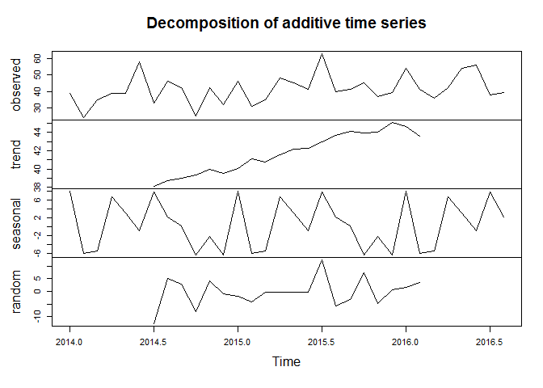
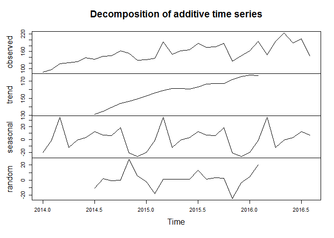
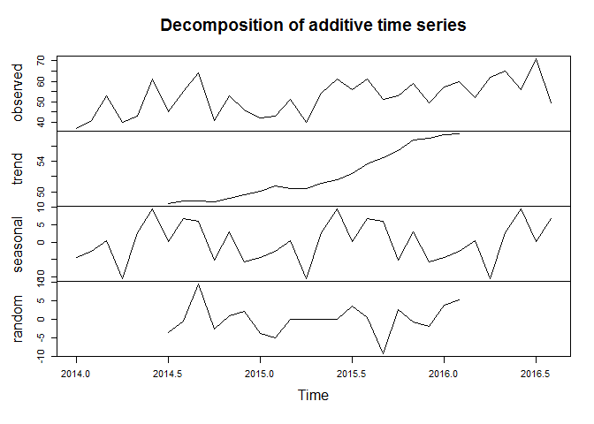
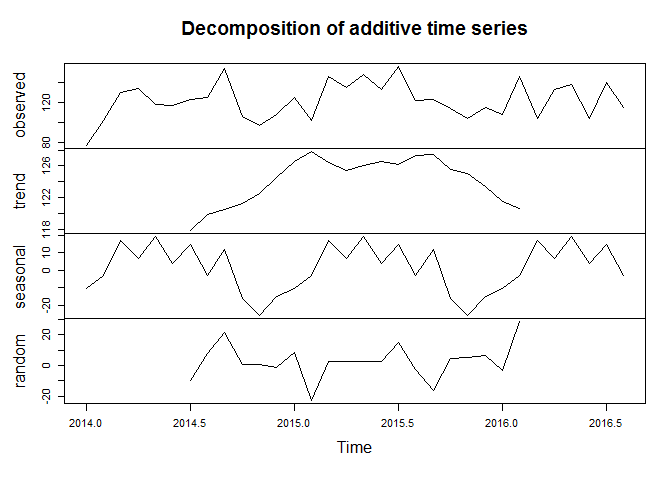
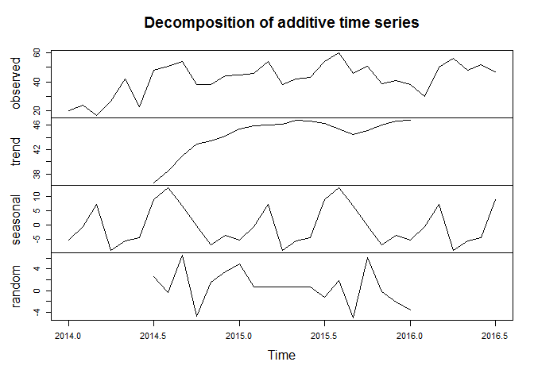
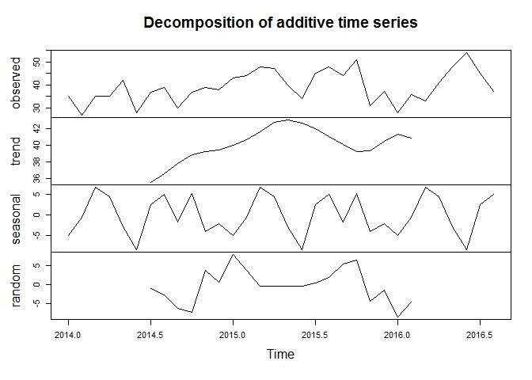

# Trend Analysis for Crime in Los Angeles, California
Steven Nichols  
December 14th, 2016  


##load original file 

```r
setwd("C:\\Users\\Steven\\Google Drive\\1. MOT\\1) Fall 2016\\1. BA\\Assignments\\Midterm\\BA_Assignment\\Final\\LAPD_Crime_Analysis")

crime_groups <- read.csv("lapd_data.csv")

##set 2014 and 2015 dates to omit hour/minutes, as these do not appear in 2016 data 
crime_groups['Date_Standard'] <- format(as.POSIXct(strptime(crime_groups$Date_Rptd,"%m/%d/%Y",tz="")) ,format = "%m/%d/%Y")

##create date vector with just month and year 
crime_groups['Month_Year'] <- format(as.POSIXct(strptime(crime_groups$Date_Standard,"%m/%d/%Y",tz="")) ,format = "%m-%Y")

##set as Date DT
crime_groups$Date_Standard <- as.Date(crime_groups$Date_Standard, "%m/%d/%Y")

library(zoo)
##set as yearmon DT
crime_groups$Month_Year <- as.yearmon(crime_groups$Month_Year, "%m-%Y")
```

##remove unncesary vectors 


```r
crime_groups <- subset(crime_groups, select=c("Date_Standard", "Month_Year", "Area_Name", "Crm_Cd_Desc"))
```

##Bin categories into simpler subsets for analysis 

```r
library(stringr)
library(dplyr)

crime_groups_cat <- crime_groups 

for (i in 1:nrow(crime_groups_cat)) {
  if (str_detect(crime_groups_cat$Crm_Cd_Desc[i], paste(c("THEFT", 'SNATCHING', "SHOPLIFTING", "FRAUD", "PICKPOCKET", "embezzlement", "STOLEN", "STEALING"), collapse="|")) == TRUE) {
    crime_groups_cat$Category[i] <- "Theft"
  }
  else if(str_detect(crime_groups_cat$Crm_Cd_Desc[i], paste(c("ROBBERY", 'BURGLARY'), collapse="|")) == TRUE)
  {
    crime_groups_cat$Category[i] <- "Robbery"
  }
  else if(str_detect(crime_groups_cat$Crm_Cd_Desc[i], paste(c('MURDER', 'HOMICIDE'), collapse="|")) == TRUE)
  
  {
    crime_groups_cat$Category[i] <- "Homicide"
  }
  
  else if(str_detect(crime_groups_cat$Crm_Cd_Desc[i], paste(c('ARSON', 'VANDALISM'), collapse="|")) == TRUE)
  
  {
    crime_groups_cat$Category[i] <- "Arson/Vandalism"
  }
  
  else if(str_detect(crime_groups_cat$Crm_Cd_Desc[i], paste(c('SEX', 'ORAL', "ANNOYING", "MOLEST", "PEEPING", "RAPE", "INDECENT", "LEWD"), collapse="|")) == TRUE)
  
  {
    crime_groups_cat$Category[i] <- "Sexual"
  }
  
  else if(str_detect(crime_groups_cat$Crm_Cd_Desc[i], paste(c('ASSAULT', 'ASSUALTING', 'BATTERY'), collapse="|")) == TRUE)
  
  {
    crime_groups_cat$Category[i] <- "Assault"
  }
  
  else if(str_detect(crime_groups_cat$Crm_Cd_Desc[i], paste(c('CHILD', 'MINOR'), collapse="|")) == TRUE)
  
  {
    crime_groups_cat$Category[i] <- "Child_Abuse"
  }
  else  {
    crime_groups_cat$Category[i] <- "Other"
  }
}

##export output to CSV because of long run time

write.csv(crime_groups_cat, file="crime_groups_categorized.csv")
```

##read in document created in companion R code file 


```r
## read in CSV file and set category as factor 
crime_groups_cat <-read.csv("crimes_categorized.csv")

crime_groups_cat$Category <- as.factor(crime_groups_cat$Category)
```


## group dataset by area name and crime category, then tally crime incidences


```r
crime_groups <- crime_groups_cat %>% group_by(Month_Year, Area_Name, Category) %>% tally()
```

## calculate z-scores to determine outliers 


```r
##order dataset by crime_groups, area_name and category so that loop functions correctly 

crime_groups<- arrange(crime_groups, Area_Name, Category)

##instantiate vectors to hold values for loop 
crime_groups['running'] <- 0
crime_groups['mean'] <- 0
crime_groups['sd'] <- 0 
crime_groups['zscore'] <- 0 
crime_groups['row_num'] <- 0

##instantiate global counting variables 
n <- 1
start <- 1

##set first row equal to itself because of loop starting on second row 

crime_groups$running[1] <- crime_groups$n[1]
for (i in 2:nrow(crime_groups)) {
  if (crime_groups$Area_Name[i] == crime_groups$Area_Name[i-1] & crime_groups$Category[i] == crime_groups$Category[i-1]) {
    crime_groups$running[i] <- crime_groups$n[i] + crime_groups$running[i-1]
    n= n+1 
    
    
  }
  
  else {
    crime_groups$running[i] <- crime_groups$n[i]
    
    crime_groups$mean[i-1] <- crime_groups$running[i-1] / (n)
    mean <- crime_groups$mean[i-1]
    end <- i-1
    crime_groups$mean[start:end] <- mean
    sd <- sd(crime_groups$n[start:end])
    crime_groups$sd[start:end] <- sd
    crime_groups$row_num[start:end]<- n
    n=1
    start <- i
   
  }
  if (i == nrow(crime_groups)) {
    crime_groups$running[i] <- crime_groups$n[i] + crime_groups$running[i-1]
    crime_groups$mean[i] <- crime_groups$running[i] / (n)
    mean <- crime_groups$mean[i]
    end <- i
    crime_groups$mean[start:end] <- mean
    sd <- sd(crime_groups$n[start:end])
    crime_groups$sd[start:end] <- sd
    crime_groups$row_num[start:end]<- n

    
  }      
  
}

## calculate z-score outside of loop 
head(crime_groups)
```

```
## Source: local data frame [6 x 9]
## Groups: Month_Year, Area_Name [6]
## 
##   Month_Year   Area_Name        Category     n running     mean       sd
##       <fctr>      <fctr>          <fctr> <int>   <dbl>    <dbl>    <dbl>
## 1   Apr 2014 77th Street Arson/Vandalism    49      49 59.35484 15.93016
## 2   Apr 2015 77th Street Arson/Vandalism    61     110 59.35484 15.93016
## 3   Apr 2016 77th Street Arson/Vandalism    64     174 59.35484 15.93016
## 4   Aug 2014 77th Street Arson/Vandalism    57     231 59.35484 15.93016
## 5   Aug 2015 77th Street Arson/Vandalism    62     293 59.35484 15.93016
## 6   Dec 2014 77th Street Arson/Vandalism    56     349 59.35484 15.93016
## # ... with 2 more variables: zscore <dbl>, row_num <dbl>
```

```r
crime_groups$zscore <- (crime_groups$n - crime_groups$mean) / crime_groups$sd
count <- 0 

crime_groups[is.na(crime_groups)] <- 0
## remove values with z-scores less than -2.8
for (i in 1:nrow(crime_groups)) {
  if (crime_groups$zscore[i] < (-2.5)) {
    crime_groups$n[i] <- crime_groups$mean[i]
   
  }
  
  else {
   TRUE == TRUE 
  }
}
```


##Look for further gaps in data and get look at overall crime trends in Los Angeles


```r
##create subset of all crime by category 
crime_groups_melt <- crime_groups %>% group_by(Month_Year, Category) %>% tally()
```

```
## Using n as weighting variable
```

```r
##melt subset and set as DF
crime_groups_melt <- melt(crime_groups_melt, id=c("Month_Year", "Category", "nn"), na.rm=TRUE)
crime_groups_melt <- as.data.frame(crime_groups_melt)
##cast category to header 
crime_groups_melt <- dcast(crime_groups_melt, Month_Year ~ Category, value.var="nn")
crime_groups_melt <- as.data.frame(crime_groups_melt)

##create multivariate time series 
crime_groups_melt.ts <- ts(crime_groups_melt, frequency=12, start=c(2014))
```


```r
library(ggfortify)
```

##Plot multivariate time series to see missing data and get look at general trends in city 
<!-- -->


```r
library(reshape2)
library(devtools)
library(vars)
```

#### Melt data to create average percent increase values for more precise look at trends 


```r
##create subset of all crime by category and area name 
crime_percent <- crime_groups %>% group_by(Month_Year, Area_Name, Category) %>% tally()
```

```
## Using n as weighting variable
```

```r
##melt subset and set as DF
crime_percent_melt <- melt(crime_percent, id=c("Month_Year", "Area_Name", "Category", "nn"), na.rm=TRUE)
crime_percent_melt <- as.data.frame(crime_percent_melt)
##cast category to header 
crime_percent_melt <- dcast(crime_percent_melt, Month_Year + Area_Name ~ Category, value.var="nn")
crime_percent_melt <- as.data.frame(crime_percent_melt)


##reset yearmon data-type and order vector by date 
crime_percent_melt$Month_Year <- as.yearmon(crime_percent_melt$Month_Year, "%b %Y")
crime_percent_melt <- crime_percent_melt[order(as.yearmon(crime_percent_melt$Month_Year, format="%b %Y")), ]

##use arrange function to also order by Area_Name for pct change calculation 
crime_percent_melt <- arrange(crime_percent_melt, Area_Name)

##instantiate new columns for percentage change

crime_percent_melt['Pct_Change_Ar'] <- 0
crime_percent_melt['Pct_Change_As'] <- 0
crime_percent_melt['Pct_Change_Ch'] <- 0
crime_percent_melt['Pct_Change_Ho'] <- 0
crime_percent_melt['Pct_Change_Ot'] <- 0
crime_percent_melt['Pct_Change_Ro'] <- 0
crime_percent_melt['Pct_Change_Se'] <- 0
crime_percent_melt['Pct_Change_Th'] <- 0
```


##loop through area name/category combos and calculate perentage change 


```r
for (i in 2:nrow(crime_percent_melt)) {
  if (crime_percent_melt$Area_Name[i] == crime_percent_melt$Area_Name[i-1]) {
crime_percent_melt$Pct_Change_Ar[i] <- ((crime_percent_melt$'Arson/Vandalism'[i] - crime_percent_melt$'Arson/Vandalism'[i-1]) /          crime_percent_melt$'Arson/Vandalism'[i-1]) * 100
  
crime_percent_melt$Pct_Change_As[i] <- ((crime_percent_melt$Assault[i] - crime_percent_melt$Assault[i-1]) / crime_percent_melt$Assault[i-1]) * 100

crime_percent_melt$Pct_Change_Ch[i] <- ((crime_percent_melt$Child_Abuse[i] - crime_percent_melt$Child_Abuse[i-1]) / crime_percent_melt$Child_Abuse[i-1]) * 100

crime_percent_melt$Pct_Change_Ho[i] <- ((crime_percent_melt$Homicide[i] - crime_percent_melt$Homicide[i-1]) / crime_percent_melt$Homicide[i-1]) * 100

crime_percent_melt$Pct_Change_Ot[i] <- ((crime_percent_melt$Other[i] - crime_percent_melt$Other[i-1]) / crime_percent_melt$Other[i-1]) * 100

crime_percent_melt$Pct_Change_Ro[i] <- ((crime_percent_melt$Robbery[i] - crime_percent_melt$Robbery[i-1]) / crime_percent_melt$Robbery[i-1]) * 100

crime_percent_melt$Pct_Change_Se[i] <- ((crime_percent_melt$Sexual[i] - crime_percent_melt$Sexual[i-1]) / crime_percent_melt$Sexual[i-1]) * 100

crime_percent_melt$Pct_Change_Th[i] <- ((crime_percent_melt$Theft[i] - crime_percent_melt$Theft[i-1]) / crime_percent_melt$Theft[i-1]) * 100
  }
}
```

## agregate and add percentage change to new df for analysis 


```r
## remove unneccesary columns
crime_percent_change <- crime_percent_melt[c(1:2, 11:18)]
crime_percent_change[is.na(crime_percent_change)] <- 0

##create vector with just year
crime_percent_change['Year'] <- crime_percent_change$Month_Year
crime_percent_change$Year <- format(crime_percent_change$Year, "%Y")

##agregate data for average change per crime, per area

##create separate DF for just percentages, as agg function requires this 
crime_percents <- crime_percent_melt[c(11:18)]

##calculate total change in crime by year 
crime_change_year_total <- aggregate(crime_percent_change, list(Year = crime_percent_change$Year),  FUN=mean, na.rm=TRUE)

##calculate change in crime by year per area
crime_change_year_area <- aggregate(crime_percents, list(Year = crime_percent_change$Year, Area = crime_percent_change$Area_Name),  FUN=mean, na.rm=TRUE)

##write to CSV 
write.csv(crime_change_year_total, file="crime_change_year_total.csv")
write.csv(crime_change_year_area, file="crime_change_year_area.csv")

crime_percent_change['Date_Export'] <- as.Date(as.yearmon(crime_percent_change$Month_Year))
write.csv(crime_percent_change, file="crime_percent_change.csv")
```

##Create list with two features per neighborhood: Most common and fastest growing 


```r
## Change column names to standard format

crime_names <- as.character(unique(crime_groups$Category))
crime_names <- c("Year", "Area", crime_names)


## subset data for year 2016
crime_percent_change_2016 <- subset(crime_change_year_area, crime_change_year_area$Year == "2016")
names(crime_percent_change_2016) <- crime_names
##remove categories for which there are too few instances to justify targeted advertising 

crime_percent_change_2016$Child_Abuse <- NULL 
crime_percent_change_2016$Homicide <- NULL 
crime_percent_change_2016$Sexual <- NULL
crime_percent_change_2016$Other <- NULL

##create vector fastest growing crime and loop to find value 
crime_percent_change_2016['Fastest'] <- 0
for (i in 1:nrow(crime_percent_change_2016)) {
crime_percent_change_2016$Fastest[i] <- names(which.max( crime_percent_change_2016[i, (3:6) ]))
}

##create df for most-common crimes in 2016

crime_totals <- crime_groups
crime_totals$Month_Year <- as.yearmon(crime_totals$Month_Year, "%b %Y")
crime_totals['Year'] <- crime_totals$Month_Year
crime_totals$Year <- format(crime_totals$Month_Year, "%Y")
crime_totals <- crime_totals[, c(1:4, 10)]
crime_totals <- subset(crime_totals, crime_totals$Year == "2016")
head(crime_totals)
```

```
## Source: local data frame [6 x 5]
## Groups: Month_Year, Area_Name [6]
## 
##      Month_Year   Area_Name        Category     n  Year
##   <S3: yearmon>      <fctr>          <fctr> <dbl> <chr>
## 1      Apr 2016 77th Street Arson/Vandalism    64  2016
## 2      Feb 2016 77th Street Arson/Vandalism    54  2016
## 3      Jan 2016 77th Street Arson/Vandalism    50  2016
## 4      Jul 2016 77th Street Arson/Vandalism    92  2016
## 5      Jun 2016 77th Street Arson/Vandalism    76  2016
## 6      Mar 2016 77th Street Arson/Vandalism    76  2016
```

```r
crime_totals <- crime_totals %>% group_by(Year, Area_Name, Category) %>% tally()
```

```
## Using n as weighting variable
```


```r
library(reshape2)
library(devtools)
library(vars)
```

##cast crime types to columns 


```r
crime_totals <- dcast(crime_totals, Year + Area_Name ~ Category, value.var="nn")
crime_totals <- as.data.frame(crime_totals)


crime_totals['Most_Common'] <- 0

for (i in 1:nrow(crime_totals)) {
crime_totals$Most_Common[i] <- names(which.max( crime_totals[i, (3:10) ]))
second_max <- max(crime_totals[i, (3:10) ][crime_totals[i, (3:10) ] != max(crime_totals [i, (3:10) ])])
crime_totals$Runner_Up[i] <- names(max(crime_totals[crime_totals[i, (3:10) ]!=max(crime_totals[i, (3:10) ])] ))
}

##standardize column mame
crime_percent_change_2016['Area_Name'] <- crime_percent_change_2016$Area
##merge two dfs into one for export 

crime_stats_2016 <- merge(crime_totals, crime_percent_change_2016, by="Area_Name")

##clean-up data by subsetting

crime_stats_2016 <- subset(crime_stats_2016, select=c("Area_Name", "Year.x", "Fastest", "Most_Common", "Arson/Vandalism.x", "Arson/Vandalism.y", "Assault.x", "Assault.y", "Child_Abuse", "Homicide", "Other", "Robbery.x", "Robbery.y", "Sexual", "Theft.x", "Theft.y"))

##clarify column names 

col_list <- c("Area_Name", "Year", "Fastest", "Most_Common", "Arson/Vandalism", "%Change_Arson/Vandalism", "Assault", "%Change_Assault", "Child_Abuse", "Homicide", "Other", "Robbery", "%Change_Robbery", "Sexual", "Theft", "%Change_Theft")

names(crime_stats_2016) <- col_list
```

##create ts and decompose for target area/crime combos 


##Arson_77th

<!-- -->

##Arson_Central

<!-- -->


##Robbery_Devonshire

<!-- -->


##Arson_Foothill

<!-- -->


##Arson_Harbor

<!-- -->


##Assault_Hollenbeck

<!-- -->


##Arson_Hollywood

<!-- -->


##Arson_Mission

<!-- -->

##Robbery_N_Hollywood

<!-- -->


##Arson_Newton

<!-- -->

##Arson_Northeast

<!-- -->

##Arson_Olympic

<!-- -->

##Assault_Pacific

<!-- -->


##Arson_Rampart

<!-- -->


##Arson_Southeast

<!-- -->


##Arson_Southwest

<!-- -->


##Arson_Topanga

<!-- -->


##Arson_Van_Nuys

<!-- -->


##Assault_West_LA

<!-- -->


##Arson_West_Valley

<!-- -->

##Arson_Wilshire

<!-- -->


